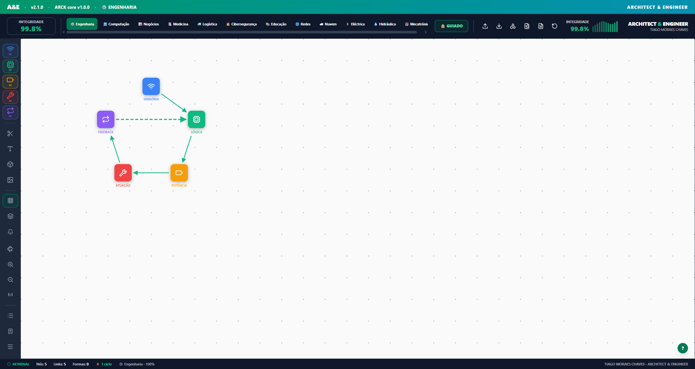

# ARCK &amp; ENGY

**Uma ferramenta visual onde desenhas a arquitectura de um sistema em camadas (L1–L5) e ela impõe as regras de ligação enquanto desenhas.**

Não é um quadro branco. Num quadro branco ligas qualquer caixa a qualquer caixa e ninguém te
avisa. Aqui, em **Modo Guiado**, uma ligação inválida **não se consegue traçar** — a
ferramenta conhece as regras das camadas e não te deixa quebrá-las.



Junto ao desenho: mede o estado do diagrama (repouso / guiado / livre-correcto / erro),
descreve o fluxo em texto automaticamente, adapta o vocabulário das camadas a 12 sectores
(engenharia, computação, negócios, medicina, logística, cibersegurança, educação, redes,
nuvem, eléctrica, hidráulica, mecatrónica), e explica *porquê* quando algo está errado.

> Este repositório é, ele próprio, uma peça: o código, as decisões (`docs/DECISOES.md`) e os
> testes são a demonstração de como se desenha e defende uma arquitectura de sistemas.
> Aberto e gratuito (MIT) — ver [DEC-015](docs/DECISOES.md).

---

## Porquê

Quem desenha arquitectura em camadas **liga as caixas mal** — salta camadas, cria
dependências para fora do núcleo, fecha ciclos no sítio errado. E o diagrama não avisa:
continua a parecer válido.

Duas verdades incómodas por trás disto:

- **Um diagrama mente sobre a sua própria validade.** Só o revisor mais atento apanha uma
  seta invertida entre centenas.
- **Ninguém revê um diagrama como revê código.** Não há linter, não há CI, não há gate.

ARCK &amp; ENGY fecha essa lacuna: torna a estrutura errada **impossível de traçar**. Ensina
por restrição, não por correcção depois do erro já estar no desenho.

## Para quê

Para o diagrama deixar de ser *desenho* e passar a ser *prova*.

Alguém abre o teu diagrama e, em segundos: vê as camadas, vê que todas as ligações são
válidas (100%), lê o fluxo descrito em texto (`L1 → L2 ⊕ [L3A | L3B] → …`). Não precisa de
confiar em ti — a ferramenta já validou.

Usos concretos:

- **Aprender** arquitectura limpa fazendo, com a rede a impedir o erro
- **Projectar** um sistema antes de escrever a primeira linha
- **Rever** a arquitectura de outra pessoa sem a decifrar à mão
- **Documentar** de forma auditável — o diagrama é um ficheiro JSON versionável no repo

## Para quem

- Quem **aprende** arquitectura em camadas e quer uma rede que impeça o erro
- Quem **projecta** sistemas antes de os construir
- Quem **ensina** arquitectura de software
- Quem **revê** a arquitectura de sistemas alheios

---

## Como correr

Requer Node 20+.

```bash
npm install
npm run dev          # abre o editor em http://localhost:5173
```

Outros comandos:

```bash
npm test             # toda a suite (core + fronteira + ui-web)
npm run build        # build de produção da interface
```

O trabalho é guardado automaticamente no browser (autosave) — fechar e reabrir recupera o
diagrama. Para o levar para outro sítio: **Exportar JSON** (o `.json` reabre e continua a
editar-se em qualquer máquina).

## Como está organizado

Monorepo com uma fronteira dura entre o núcleo e a interface:

| Pacote | O que é | Testes |
|---|---|---|
| [`packages/core`](packages/core) | O motor, em TypeScript puro — **ARCK** valida as ligações, **ENGY** mede a tensão, **MENTOR** explica. Sem React, sem DOM, sem browser. | 44 (coração) + 11 (fronteira), `tsx` |
| [`packages/ui-web`](packages/ui-web) | O editor visual — React + Vite. Canvas SVG, `useReducer` com transições nomeadas e testadas uma a uma. | 174, `vitest` + `jsdom` |

A regra de ouro: **a lógica de domínio vive só no `core`**. A interface nunca decide o que é
uma arquitectura válida — pergunta ao `core`.

Documentação de arquitectura e história das decisões:

- [`docs/DECISOES.md`](docs/DECISOES.md) — cada decisão de direcção, com a razão e as
  divergências Arquitecto ↔ Engenheiro. O "porquê" por trás do histórico de git.
- [`docs/MOVIMENTO_7.md`](docs/MOVIMENTO_7.md) · [`docs/MOVIMENTO_8.md`](docs/MOVIMENTO_8.md) — os planos de refactor e de features, fatiados e testados.
- [`docs/POSICIONAMENTO.md`](docs/POSICIONAMENTO.md) — as quatro perguntas (o quê / porquê / para quê / para quem) de que parte todo o material.
- [`docs/fundacao/`](docs/fundacao) — o método de fundação (aberto sob CC BY 4.0).

## Estado

Em desenvolvimento activo. Já funciona: 5 camadas × 12 sectores, validação de fluxo em Modo
Guiado, Modo Livre, medidor de integridade, relatório de fluxo automático, formas
geométricas, notas, vista 3D, imagem de fundo, autosave, exportação SVG/PNG/JSON.

Ainda não: responsivo em telemóvel/tablet (só rato, sem toque) — ver
[`docs/referencias/layout-alvo.md`](docs/referencias/layout-alvo.md).

## Licença

- **Código** (raiz + `packages/`): [MIT](LICENSE)
- **Método de fundação** (`docs/fundacao/`): [CC BY 4.0](docs/fundacao/LICENSE), crédito a Tiago Moraes Chaves

Autor: **Tiago Moraes Chaves** — Arquitecto de Sistemas.
